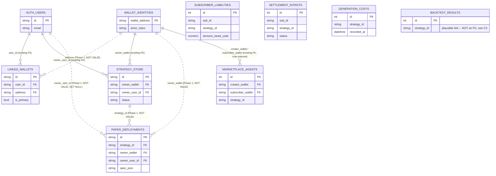

# Database Relations — Identity, Ownership, and the Schema-Relations Audit

> **status:** current
> **owner:** Dan Browne
> **updated:** 2026-08-20
> **superseded-by:** —

Companion to [`database-architecture.md`](database-architecture.md) (the two-store
overview). This doc is scoped narrower: the **relational structure between identity,
ownership, and money tables** — where a foreign key or an index is missing, what an
audit of that gap found once every claim was checked against the actual code, and what
shipped in response. Phase 1 (indices + gated FKs) is live as of the PR this doc landed
with; Phase 2 (write-path changes) is a proposal only — nothing in it is built.

## 1. Audit summary

An earlier pass proposed a schema-relations fix list. Before building anything, every
load-bearing claim in that proposal was checked against the running code. Three
corrections and two gaps changed the plan; everything else held up.

### 1.1 Corrections to the original audit

| # | Original claim | Verified reality | Effect on the plan |
| --- | --- | --- | --- |
| **C1** | Every table's row count is "<5k everywhere" | The only in-repo **production measurement** is in [`backend/migrations/versions/f0ab58339d55_dedupe_backtest_results_canonical_hash.py`](../backend/migrations/versions/f0ab58339d55_dedupe_backtest_results_canonical_hash.py) — *"Measured against production 2026-08-20 (read-only query): **646 rows over 51 distinct strategies**"* — and that migration then collapses most of them. Every other table's count is **unverified**. | A plain `CREATE INDEX` / `NOT VALID` migration is safe at this scale, but nothing may assume zero orphans without checking — see § 2.3's runtime gate. |
| **C2** | Alembic migrations are *the* schema path | [`backend/migrations/env.py`](../backend/migrations/env.py) states the two-path design explicitly: **Alembic owns Postgres/prod; `Base.metadata.create_all()` owns SQLite (all tests + local dev)**. [`backend/tests/test_alembic_migrations.py`](../backend/tests/test_alembic_migrations.py)'s parity gates compare **columns only**, never constraints or indices. | A Postgres-`NOT VALID` migration is architecturally legal and breaks no existing gate — but also means constraint drift between the two paths was previously undetected. This PR adds dedicated tests closing that gap for the tables it touches (§ 3). |
| **C3** | `backtest_results.strategy_id` has no FK to `strategy_store.id`, framed as a plain oversight | Both id spaces are the *same value in practice* — [`main.py`](../backend/archimedes/main.py) seeds every provider strategy into `strategy_store` with `id=s.id`, and [`strategy_provider.py`](../backend/archimedes/services/strategy_provider.py) syncs the same objects into `strategy_passports`. **But both writers are explicitly best-effort**: `main.py` logs *"startup: example strategy seed failed (non-fatal)"* on exception, and `strategy_provider.py` logs *"unified table sync failed (non-blocking)"*. | The invariant is **plausible, not provable**. This PR does **not** add that FK. Doing so on unverified data would be exactly the mistake the gated-FK pattern (§ 2.3) exists to avoid. |

### 1.2 Two gaps the original audit missed

**G1 — Generation revenue is not persisted anywhere.**
[`services/generation_payment.py`](../backend/archimedes/services/generation_payment.py)
verifies and settles a real USDC payment through the Circle facilitator, then:

```python
payment = await middleware.settle(header, price)
logger.info(
    "generation payment settled: payer=%s amount=%s tx=%s",
    payment.payer, payment.amount, payment.transaction,
)
return payment
```

`payer`, `amount`, and `transaction` go to **a log line and nowhere else** — there is no
`generation_payments` table and no model. **"How much has a user paid" is unanswerable
from the database today.** Closing this requires a writer change, so it is a Phase 2 item
(§ 4) — out of scope for an additive-only PR.

**G2 — `paper_deployments` is excluded from account adoption.**
`api/wallet_routes.py`'s `claim_legacy_wallet_data` default model tuple is
`(StrategyRecord, StrategyPassportRecord, StrategyProposal, VaultMetadata)` plus
`UserProfile`. `PaperDeployment` appears nowhere in that file. Combined with
`paper_routes.py`'s ownership check (`dep.owner_user_id != user_id` is the *sole* gate), a
paper deployment made before a wallet link is permanently unreachable by its owner once
that wallet does get linked. Code fix, Phase 2 (§ 4).

### 1.3 Confirmed as originally stated

- **A1** — no FK between `linked_wallets.address` and `wallet_identities.wallet_address`;
  `.address` was entirely unindexed (`models/account.py`). **Fixed in Phase 1** (§ 2).
- **A2** — `claim_legacy_wallet_data` filters `model.owner_user_id.is_(None)`: it fills a
  NULL owner, it never corrects a mismatched one. Unchanged by Phase 1 (behavioral, not
  schema).
- **A3 / B2** — documented anti-goal in `generation_cost.py`: the cost-measurement table
  is deliberately price-free (`assert_measurement_only` raises if a price leaks in).
- **B3 / B4** — `strategy_provider.py`'s `fixture = self._fixtures.get(path.stem)` is the
  only stem↔id bridge in the curated-strategy loader.

## 2. Phase 1 — shipped

Additive only, no writer changed. Three classes of change, all reversible:

### 2.1 Ten indices

Postgres does not auto-index foreign-key columns, and several of these composite indices
existed but led with the wrong column for the query shape that actually runs.

| Index | Table (columns) | Why |
| --- | --- | --- |
| `ix_linked_wallets_address` | `linked_wallets(address)` | The sole bridge between Better Auth and the SIWE ledger (A1) was a full seq scan on every "which account owns wallet W" query. |
| `ix_paper_deployments_owner_user_id` | `paper_deployments(owner_user_id)` | `paper_routes.py` filters exactly this column to list a user's deployments — the user-facing hot path — with no index. |
| `ix_identity_events_wallet_time` | `identity_events(wallet, occurred_at)` | Existing indices are `(wallet, event_type)` and `(event_type, occurred_at)` — neither serves "one user's activity over time." |
| `ix_subscriber_liabilities_sub` | `subscriber_liabilities(sub_id)` | This table carried **zero** indices before this PR, on a table holding `amount_owed_usdc`. |
| `ix_subscriber_liabilities_strategy_created` | `subscriber_liabilities(strategy_id, created_at)` | Same table, revenue-over-time shape. |
| `ix_settlement_intents_sub` | `settlement_intents(sub_id)` | The one existing index leads with `strategy_id`, so "settlements for subscriber X" seq-scans. |
| `ix_settlement_intents_status_created` | `settlement_intents(status, created_at)` | Same table, revenue-over-time shape. |
| `ix_marketplace_agents_subscriber_wallet` | `marketplace_agents(subscriber_wallet)` | Already an FK column; Postgres never auto-indexes those. |
| `ix_marketplace_agents_creator_wallet` | `marketplace_agents(creator_wallet)` | Same. |
| `ix_generation_costs_recorded_at` | `generation_costs(recorded_at)` | Cost-over-time is a core owner metric; only `strategy_id` and `(job_id, strategy_id)` were indexed. |

Built with plain `CREATE INDEX`, deliberately **not** `CONCURRENTLY` — `CONCURRENTLY`
cannot run inside Alembic's transaction (it forfeits atomic rollback and can leave an
`INVALID` index behind on failure), and at this repo's only measured production scale
(C1: 646 rows) a plain index build is milliseconds. A brief `SHARE` lock is the better
trade.

### 2.2 One column widen

`paper_deployments.strategy_id` — `VARCHAR(64)` → `VARCHAR(128)`, matching
`strategy_store.id`'s width ahead of the FK below. Legal in Postgres (both are
`character varying`, same operator family — a widen is metadata-only, no table rewrite).
Actual values are `content_hash[:16]` (16 characters), so this is headroom, not a
live-data change.

### 2.3 Three foreign keys, all gated at runtime

| FK | Columns | `ON DELETE` |
| --- | --- | --- |
| `fk_linked_wallets_address_wallet_identity` | `linked_wallets.address` → `wallet_identities.wallet_address` | `NO ACTION` |
| `fk_paper_deployments_owner_user_id` | `paper_deployments.owner_user_id` → `auth_users.id` | `SET NULL` (matches the five identical FKs `b7e3f1a2c9d4` already added to sibling ownership columns) |
| `fk_paper_deployments_strategy_id` | `paper_deployments.strategy_id` → `strategy_store.id` | `NO ACTION` |
| `fk_paper_deployments_owner_wallet` | `paper_deployments.owner_wallet` → `wallet_identities.wallet_address` | `NO ACTION` |

**Every one of these is created `NOT VALID` on Postgres**, then the migration
**immediately runs the orphan-count query against the same live connection** and issues
`VALIDATE CONSTRAINT` only when that count is zero. This is a deliberate change from "a
human runs a pre-flight checklist before deploying": with only one production row count
ever measured (C1), a migration that blindly issues `VALIDATE CONSTRAINT` on unmeasured
data is how a "minimal blast radius" change becomes an outage — a failed `VALIDATE` holds
an `ACCESS EXCLUSIVE` lock for its duration. Running the exact same check the audit
specified, but from inside the migration against whatever database it is actually
applied to, makes the safety property hold unconditionally instead of depending on
someone remembering to run it first.

An orphan count above zero is not a failure. For
`fk_paper_deployments_strategy_id` / `fk_paper_deployments_owner_wallet` it is the
**expected** outcome (no historical backfill has ever run against those columns) — the
constraint stays `NOT VALID`, enforcing all future writes while historical rows are left
exactly as they were. `NOT VALID` / `VALIDATE CONSTRAINT` have no SQLite equivalent; on
SQLite the same named constraints are still added (via `batch_alter_table`'s
table-rebuild path — this repo's established two-path pattern), just without an orphan
gate, since SQLite doesn't validate FK data on `ALTER` unless `PRAGMA foreign_keys=ON`,
which nothing in this repo's default connection sets.

The orphan queries the migration runs are the same shape the original audit specified for
a human to run by hand:

```sql
-- fk_linked_wallets_address_wallet_identity
SELECT COUNT(*) FROM linked_wallets lw
  LEFT JOIN wallet_identities wi ON lw.address = wi.wallet_address
 WHERE wi.wallet_address IS NULL;

-- fk_paper_deployments_owner_user_id
SELECT COUNT(*) FROM paper_deployments pd
  LEFT JOIN auth_users au ON pd.owner_user_id = au.id
 WHERE pd.owner_user_id IS NOT NULL AND au.id IS NULL;

-- fk_paper_deployments_strategy_id
SELECT COUNT(*) FROM paper_deployments pd
  LEFT JOIN strategy_store ss ON pd.strategy_id = ss.id
 WHERE ss.id IS NULL;

-- fk_paper_deployments_owner_wallet
SELECT COUNT(*) FROM paper_deployments pd
  LEFT JOIN wallet_identities wi ON pd.owner_wallet = wi.wallet_address
 WHERE pd.owner_wallet IS NOT NULL AND wi.wallet_address IS NULL;
```

Migration source:
[`backend/migrations/versions/fb8d0bae8112_schema_relations_phase1.py`](../backend/migrations/versions/fb8d0bae8112_schema_relations_phase1.py).

### 2.4 Explicit skip

No FK from `backtest_results.strategy_id` to `strategy_store.id` — see C3 above. Adding
it on unverified data is exactly what the gated-FK pattern exists to prevent doing blind.

## 3. Target ERD (post-Phase-1)

Solid lines are FKs that existed before this PR (fully enforced). Dashed lines are the
three FKs this PR added `NOT VALID` — enforced for every future write, not yet proven
against 100% of historical rows on tables whose count was never measured (C1).



`BACKTEST_RESULTS` is drawn with no relationship line to `STRATEGY_STORE` on purpose — the
plausible-but-unproven link from C3 is the point being made visually: everything else on
this diagram is either a real constraint or an explicit, reasoned skip.

## 4. Phase 2 — proposal, not built

Nothing below is implemented. Both items require a writer change, which is why they were
excluded from the additive-only Phase 1 PR.

**G1 — persist generation revenue.** Add a `generation_payments` table
(payer, amount, transaction hash, strategy/job linkage, timestamp) and write to it at the
point `generation_payment.py` currently only logs the settled payment. Until this lands,
"how much has a user paid" stays unanswerable from the database — the log line is not a
substitute for a row a query can aggregate.

**G2 — adopt `paper_deployments` into account linking.** Add `PaperDeployment` (keyed on
`owner_wallet`) to `claim_legacy_wallet_data`'s default model tuple in
`api/wallet_routes.py`, alongside `StrategyRecord`, `StrategyPassportRecord`,
`StrategyProposal`, and `VaultMetadata`. Without this, a paper deployment made before a
wallet link is permanently unreachable by its owner even after they link that wallet —
`paper_routes.py`'s ownership check is `owner_user_id`-only, and nothing currently
backfills it for pre-existing `paper_deployments` rows the way the four models above
already get backfilled.

**Related, deliberately not proposed:** the `backtest_results.strategy_id` FK from C3.
Both writers that establish the id-space equality are best-effort / non-fatal on failure;
making either one durable (so the invariant becomes provable, not just plausible) is a
precondition for that FK, not a Phase 2 line item in its own right.
