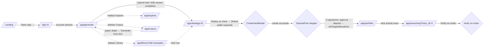

# Archimedes — User Stories & The One Spine

> **status:** current
> **owner:** Dan Browne
> **updated:** 2026-08-31
> **superseded-by:** —

> **Re-verified 2026-08-31** against the live system (`GET /api/health`), not against
> memory. The spine below is unchanged and still canonical. Three MVP-scope claims were
> wrong and are corrected in place, each marked inline: the `/generate` "fusion preview"
> surface (superseded by the debate society,
> [ADR](adr/debate-society-sole-generation-pipeline.md)), "GLM-backed" (live LLM is
> `bedrock_converse` / `amazon.nova-micro-v1:0`,
> [ADR](adr/glm-to-bedrock-llm-migration.md)), and the curated-library size. Vault
> execution reads as present tense throughout this doc because it was written that way on
> Day 9; it is **roadmap, not shipped product** — see `CLAUDE.md` § Project and #1469.

> **Status:** Day-9 rewrite (2026-05-20). The spine is locked; this rewrite refocuses
> the doc around **who the user is and what they're trying to do**, with the
> Linus/KnowledgeBase architectural lineage moved out to
> [`docs/research/linus-archimedes-comparison.md`](research/linus-archimedes-comparison.md)
> so it doesn't crowd the user-facing story. Read alongside
> [`design.md`](archive/agora-2026-05/design.md), [`corpus-architecture.md`](corpus-architecture.md), and
> ``demo-script-pitch-deck-outline.md`` (routed to the private docs repo, 2026-08-19).

## One-line definition

**Archimedes is a research-grounded strategy-generation instrument for non-experts who
want their idle USDC to compound thoughtfully** — fusing what you want with current
market conditions and 10,000 q-fin research papers into novel strategies, gating them
through selection-bias rigor (so you only see what's defensibly real), executing them
into your non-custodial vault on Arc, and surfacing every reasoning step so you can
inspect what worked and what didn't.

> **Testnet reality (read this first).** Arc has **no mainnet** — it's testnet-only
> (Circle's docs list mainnet as "upcoming"; the public testnet "mirrors mainnet
> behavior, no real assets"). The honest user story is *"try the full flow on the Arc
> public testnet with faucet USDC"* (<https://faucet.circle.com/>, 20 USDC / 2h,
> USDC-is-gas) — **no real funds at risk, by design.** This is a strength, not a
> hedge: it's the correct posture for an Arc-stage project. Real-funds custody,
> mainnet, and the regulatory architecture are the mainnet / business-plan roadmap.

## The primary archetype — the **capable non-expert**

The user we are building for, in detail. Almost every product decision should be
defensible against this archetype.

**Who they are:**

- Has idle USDC (or wants to). Salary income, side-business income, crypto-native
  savings — any source. Not pre-allocated to anything urgent.
- Curious about quantitative finance but not a quant. May know what "Sharpe ratio"
  means but probably can't define DSR or PBO without help. Comfortable enough with
  numbers to read a chart.
- Has tried robo-advisors and found them opaque ("why these allocations?").
- Has watched crypto influencers shill strategies and noped out (correctly).
- Has been tempted by AI-flavored portfolio agents but doesn't trust them — *what is
  the agent actually thinking? where does it get its ideas from? is it just a chatbot
  pretending to be a quant?*
- Wants the system to work **semi-autonomously**. Doesn't want to babysit it daily.
  Does want to be able to inspect what it did and why, on demand.

**What they want:**

> "An app that helps me make money. That works mostly on its own. That I can trust
> because I can see what it's doing and why it's doing it. That doesn't require a
> finance PhD to operate or a crypto-degen tolerance for risk."

**What they explicitly do NOT want:**

- A wall of jargon they have to Google.
- An "AI" that gives them strategies with no provenance.
- A robo-advisor that tells them their allocation without explaining why.
- A chat interface they have to babysit ("ask me for a strategy" is *also* a wall;
  the system should propose useful defaults).
- An app that disappears their losses (silently rotating away from losing positions
  with no explanation is the failure mode of every "AI fund").
- A wallet that holds their funds for them (non-custodial only).

**Implication for the product:** every page should be readable by this person on
first visit. Acronyms get in-line definitions. Numbers have context. Reasoning is
always available, never hidden. The interface defaults to *propose*, not *prompt*.

## Secondary lens — the **judge-as-operator**

A Stellar / Coinbase / Arc / Circle / Protocol Labs judge who reads the repo and
clicks through the live link like an operator would. The judge isn't the customer,
but **what serves the judge serves the customer**: a fast, legible path through the
product that demonstrates the wedge without needing the judge to read the deck first.

## The one spine (this is the whole product story)

```
   describe intent
        │
        ▼
   ① GENERATE      research-grounded strategy from your intent,
                   fused across user brief × market regime × q-fin corpus
        │
        ▼
   ② RIGOR-GATE    DSR / PBO / walk-forward — the curation protocol;
                   only what clears it is admitted to your library
        │
        ▼
   ③ EXECUTE       allocate it into a non-custodial vault (testnet USDC on Arc)
        │
        ▼
   ④ MONITOR       portfolio, results, and the agent's on-chain reasoning
        │
        ▼
   ⑤ EXPLORE       your compounding library + the underlying research,
                   plus the LEARNINGS surface (wins AND losses, with reasoning)
```

Each step, expressed as the story the user is living:

### ① Generate

> *"I describe what I want — steady growth, low drawdown, maybe a 5-year horizon — in
> plain English. Archimedes proposes a strategy and shows me which research papers
> informed it. The first thing I see is a citation, not a confident assertion."*

### ② Rigor-gate

> *"I see whether the proposed strategy *survives* a battery of statistical tests
> before I'm asked to deploy it. If it doesn't pass — the strategy is preserved in
> a 'considered but rejected' bucket with the reasoning intact, so I can see what
> was tried. If it passes, the verdict cards (DSR, PBO, OOS Sharpe, look-ahead
> audit) are visible with plain-English explanations next to each."*

### ③ Execute

> *"I deposit testnet USDC into a non-custodial vault that runs the strategy. The
> only step that needs my wallet. The vault tells me, in advance, what authorities
> the agent has (rebalance, yes; withdraw-to-platform, never). I confirm. Done."*

### ④ Monitor

> *"I check in. I see how my portfolio is performing, what the agent has done
> recently, and why. Every rebalance has a reasoning trace I can open — what market
> conditions it saw, what papers it referenced, what it decided. The full trace is
> hashed and anchored on Arc — I can verify it wasn't rewritten."*

### ⑤ Explore (Library + Learnings)

> *"I browse my growing library of strategies — the ones running, the ones rejected
> by the rigor gate (and why), the ones I generated and never deployed. I also
> browse the underlying paper corpus when I want to understand the field. **And I
> visit the Learnings page** to see which of my (and the system's) strategies have
> performed well, which haven't, and what the agent's reasoning was in each case —
> losing trades are first-class learning material, not hidden failures."*

## The canonical click path

The spine above is the story. This is the same story as routes and clicks — seven steps
from a cold landing page to a verified on-chain decision. Relocated here from `README.md`
(2026-08-20) so the click path and the spine stay in one place.



Every other route (Library tabs, Corpus Graph/KG, Explore sparklines, Learnings) is
reachable from the sidebar but supplementary. What each page is *for*:
[`specs/page-roles-spec.md`](specs/page-roles-spec.md). What the wallet signatures in the
`DepositFlow` step actually are: [`specs/vault-semantics-spec.md`](specs/vault-semantics-spec.md).

## Stories by page / surface

The pages exist to support the spine. Each one earns its place by enabling specific
user moves.

### `/` Landing

> *"As a first-time visitor, I want to understand in 30 seconds what this is and why
> I might trust it, before I'm asked to connect anything."*

**Surfaces:** product framing (Linus-for-q-fin tagline), the 5-step spine
visualization, the wedge (research-grounded + rigor-gated + provenance-anchored),
the honest-framing statement (testnet posture, no-alpha-promise). Big CTA: **Generate
a strategy** (no wallet required).

### `/generate` Generate (the new primary action)

> *"As a user, I want to describe what I want and see a candidate strategy come back
> — grounded in named papers, with the rigor verdict visible — without first having
> to pick from a menu of pre-built options."*

**Surfaces:** the natural-language brief input + optional structured inputs (asset
class, risk, horizon) + the live SSE debate stream (proposer pool → bull/bear round →
deterministic critics → K=1 winner + considered-rejects) + the
result card (strategy spec, citations, rigor verdict, deploy CTA) + the
**Portfolio Advisor preview banner** (rendered after a candidate completes — shows
Kelly + risk-parity allocation, DSR/PBO/walk-forward OOS rigor counters, six-scenario
stress matrix, variance decomposition, correlation pairs, and the keccak reasoning-trace
hash for the proposed portfolio — all *before* the user commits any funds). See
Prompt 3 in ``claude-design-prompts.md`` (routed to the private docs repo, 2026-08-19) for the screen
design.

> **Corrected 2026-08-31.** This bullet used to name a "3-input fusion preview ('what
> fusion will see')". That surface described the pre-debate routing tree and never
> shipped — `_pick_pipeline()` returns `"debate"` unconditionally
> ([`agents/generation_pipeline.py`](../backend/archimedes/agents/generation_pipeline.py)),
> fusion is a *step inside* the society rather than a standalone preview, and no
> fusion-preview component exists in `ui/src`. Decision:
> [`adr/debate-society-sole-generation-pipeline.md`](adr/debate-society-sole-generation-pipeline.md)
> (supersedes `adr/fusion-primary-generation.md`); mechanics:
> [`specs/multi-agent-debate-spec.md`](specs/multi-agent-debate-spec.md).

### `/portfolio` My Portfolio (consolidates current Trade + Vaults + personalized Risk view)

> *"As a depositor, I want one place to see what I own, how it's performing, and what
> the agent has done — without bouncing between 3 tabs."*

**Surfaces:** total value + 24h/7d change + computed risk profile + portfolio equity
curve vs SPY + holdings table + active-strategies cards + agent activity feed (each
entry deep-links to its reasoning trace). Sidebar: deposit / withdraw / rebalance +
the risk-band visualization (consolidated from the standalone Risk page).

### `/library` Library (consolidates current Marketplace + Strategies + Corpus Explorer)

> *"As a curious user, I want to browse what's been generated, what's been validated,
> and what research underlies it — in one place, with filters that make sense."*

**Surfaces:** three tabs at top — All Strategies / Papers / Vault Leaderboard. Left
filter rail (asset class, risk tier, rigor verdict, sort). Empty-state nudge back to
Generate. Each strategy card links to its passport (see below).

### `/strategy/:id` Strategy passport

> *"As someone considering depositing into a strategy, I want to see the full provenance
> — the source papers, the methodology in plain English, the backtest results vs the
> paper's claims, the rigor verdict with each gate explained, and the on-chain
> verification — so I can decide whether to trust this with my USDC."*

**Surfaces:** the Day-9 passport per Prompt 4 in
``claude-design-prompts.md`` (routed to the private docs repo, 2026-08-19) — strategy name + Tier badge,
academic-style paper citation, real backtest numbers with paper-claim deltas, the
4-gate rigor panel (DSR + PBO + OOS Sharpe + look-ahead) with plain-English explainers,
equity-curve chart, on-chain trace anchor with Verify button, source-papers section.

### `/learnings` Learnings (NEW — strongly endorsed by user feedback)

> *"As a user managing a portfolio over time, I want to see honestly which strategies
> are working, which aren't, and **why** — with the agent's reasoning available for
> both winners and losers — so I can develop my own intuition rather than treat the
> system as a black box."*

**Surfaces:** two-column layout — "Winners" (currently profitable strategies, sorted
by realized return) and "Losers" (currently underperforming, sorted by drawdown).
Each card has the realized return + a "What went right/wrong" summary generated from
the agent's reasoning traces over the relevant period + the reasoning-trace links
themselves. **This is the surface that proves we don't hide losses.**

### Reasoning trace viewer (modal, opens from anywhere)

> *"When I click 'view reasoning' on any decision, I want to see what the agent saw,
> what papers it referenced, what it decided, and how to verify the trace wasn't
> rewritten."*

**Surfaces:** market context, source-signals papers, prose reasoning (with inline
acronym definitions), action taken (before/after weights + trades + tx hashes), tool
calls (collapsible), verification footer with hash + Verify button. See Prompt 5 in
``claude-design-prompts.md`` (routed to the private docs repo, 2026-08-19).

## The jargon problem — in-line definitions, not a glossary page

A glossary page loses context (the user is reading about DSR on the passport, has to
leave the page to look it up, comes back having lost their place).

**Convention adopted:** any finance acronym (DSR, PBO, Sharpe, Calmar, OOS, MVO,
Kelly, CAGR, MDD, vol, IS) on first appearance within a section gets a small
dotted-underline link; hover or tap opens a 1-2 sentence definition popover with a
"learn more" link to a deeper explainer for the user who wants to go further.
Acronyms expanded on first use within a section ("Deflated Sharpe Ratio, DSR").

If we add an `/explain` route later, it should be a *deeper* explainer for the user
who clicks "learn more" from a tooltip — not the front door.

## Honesty rules in effect

These constraints are user-story-level, not architecture footnotes. They're load-
bearing for trust.

- **We don't promise alpha.** We promise evidence-grounded generation with externally
  verifiable rigor. Past performance, even of validated strategies, doesn't guarantee
  future returns.
- **Arc is testnet by design.** Putting real funds on a chain that's pre-mainnet
  would be reckless. Contracts are real; settlement is real testnet USDC.
- **The corpus is generated-from, not retrieved-from.** The LLM reads cited papers
  and produces a strategy spec; it does not lift strategies verbatim.
- **Losing strategies are visible.** The Learnings page surfaces both winners and
  losers. Silently rotating away from losses is the failure mode of every "AI fund"
  — we explicitly don't.
- **The rigor gate can be wrong.** A strategy that passes DSR/PBO might still
  underperform out-of-sample; a strategy that fails might have been over-cautiously
  rejected. The gate is a *bar*, not a guarantee. We surface the verdict and the
  inputs that produced it.

## Judge happy-path (the ~3-min demo, read-only until deposit)

1. Landing → **Generate** (no wallet). Describe a goal, click Generate.
2. **Generated result** — see a paper-grounded strategy with the rigor verdict
   visible. Open the passport. Verify a paper citation. Click "Verify trace."
3. **Library** — see other strategies (Tier-1 + rejected). Open one of the rejected
   ones, see why it failed the gate. (This is the honesty proof point.)
4. **Learnings** — see which strategies have performed well and which haven't, with
   the agent's reasoning available for each. (The "we don't hide losses" proof.)
5. **Vault detail** (or "Deploy" CTA on the generated strategy) — show the
   non-custodial vault structure, the agent's authorities.
6. **Wallet wall** appears **only at Deposit** — the single gated action.

## Scope

**In (the MVP we ship & demo):** the single-user spine end-to-end, one user at a
time, hosted, **on the Arc public testnet with faucet USDC (no real funds)**. The
curated reference library plus the generator-produced strategies. The DB-backed
10,000-paper q-fin corpus + the live Corpus Explorer. The rigor gate with real 22-year
SPY data. On-chain reasoning traces via the deployed `ReasoningTraceRegistry`.

> **Corrected 2026-08-31.** Two claims in this paragraph were stale.
> **(a) "GLM-backed"** — the live LLM is `bedrock_converse` / `amazon.nova-micro-v1:0`
> ([ADR](adr/glm-to-bedrock-llm-migration.md)); BYOK and local-Ollama paths survive behind
> the `LLM_*` seam. Live values: `GET /api/health` → `llm_provider`, `llm_model`.
> **(b) "The 5 reference strategies (2 of them currently Tier-1)"** — the curated library
> is neither of those numbers today (`GET /api/health` → `strategy_count`; consolidation
> plan in [`audits/2026-07-09-curated-consolidation.md`](audits/2026-07-09-curated-consolidation.md)),
> and the *passing* count is deliberately **unestablished** — the earlier pass count graded
> equity-like series through a data-feed fallback, so no number is quoted here on purpose
> (`CLAUDE.md` § The hard constraint).

**Out (stated vision / roadmap — narrate, do not build):**

- **Multi-user accounts.** Single-user is the MVP; multi-user is the roadmap.
- **A social network of shared strategies & vaults.** Users publishing strategies
  others can discover, allocate to, and fork. The same curated-library substrate,
  made social. Strengthens the pitch as a clear expansion path; building it doesn't
  fit the hackathon window.
- **Mainnet + real-funds custody.** Requires the regulatory architecture (off-chain
  redemptions, preset-strategy / RIA posture, exploit alerting).
- **The full KB-pipeline artifact (#101, now tracked as #778).** Substrate is scaffolded
  (named volume mounted, `cluster_id`/`topic_label` columns ready); the embedding +
  clustering + KG build has still not run. **Corrected 2026-08-31:** the graph/KG
  endpoints do *not* synthesise a demo from on-the-fly DB queries — that was the Day-9
  plan and it was rejected. `/graph` returns an honest 503 `kb_artifact_not_found` and
  `/kg/*` returns empty sets, pinned by `backend/tests/test_corpus_claim_integrity.py`.
- **Real semantic retrieval (#96 → #778).** **Corrected 2026-08-31:** retrieval is a
  keyword filter plus a *query-time* rerank of the candidate set — nothing is stored, and
  `GET /api/health` publishes both facts separately (`corpus_embedded_at_rest` for the
  corpus, `paper_rerank_model_live` for the process). SPECTER2 + KG remains unbuilt.

## Open items to verify (🔍 — owners: Marten / Daniel R., per #39)

- 🔍 Is the entire hero path (Generate → result → Library → Learnings → Vault)
  traversable **read-only with no wallet**, gating only at Deposit?
- 🔍 Do refresh / browser-back / shared deep-links survive mid-journey across the
  new consolidated page tree?
- 🔍 Does the in-line acronym tooltip convention render correctly on touch devices
  (tap-to-open + dismiss-by-tap-outside)?
- 🔍 Does the Learnings page have enough live data (winners and losers) to be
  visually populated during the demo? If not, we need to either deploy more strategy
  variation or seed the page with example outcomes that are clearly labeled.

## Definition of done

- This spine is the single narrative in the README, the deck, the live app, and any
  external comms (Discord, Twitter, launch tweet).
- No placeholder ("est.") metrics anywhere on the judge path (ties to the rigor-wedge
  P0; verified done as of #105 + #108).
- 🔍 items resolved by the walkthrough; the canonical strategy surface chosen.
- Capable-non-expert can land on `/`, click Generate, and produce + understand a
  strategy without leaving the app for a Google search.

---

## Architectural lineage (one-line pointer)

The Linus / KnowledgeBase primitives Archimedes ports (RAG gateway, tool registry,
agent spawner, sandbox, audit log, layered-memory model, quality scorecard) are
documented in [`docs/research/linus-archimedes-comparison.md`](research/linus-archimedes-comparison.md).
That content used to live in this file but it's architectural history, not user
stories — it crowds the user-facing narrative and the team can read it on demand.
